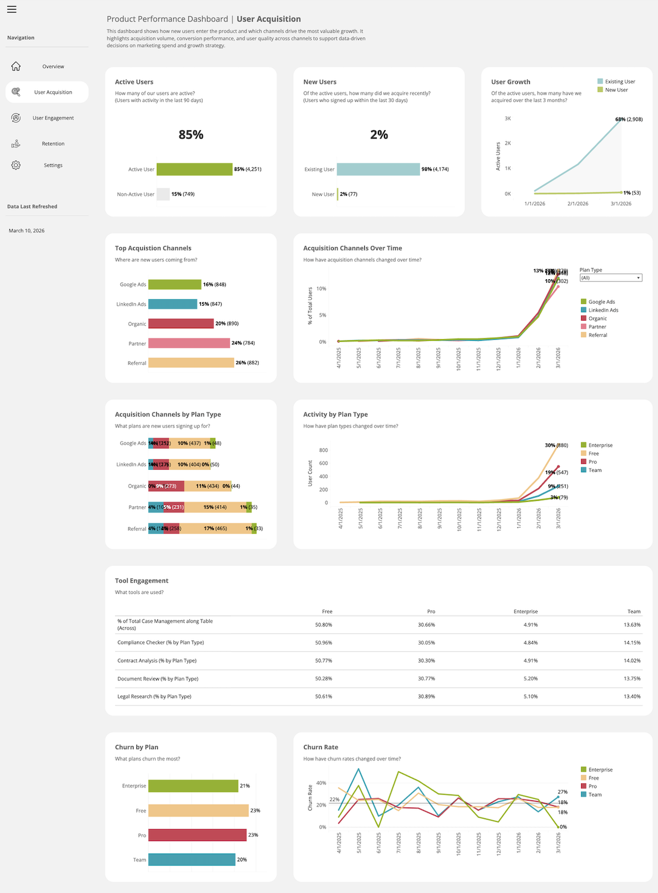

# SaaS Product Analytics Dashboard

A data analytics project that explores key SaaS metrics and builds a dashboard to analyze user behavior, revenue trends, and business performance.

---

## Project Overview

This project focuses on analyzing SaaS product data to uncover insights about user acquisition, retention, churn, and revenue.

It demonstrates how raw data can be transformed into meaningful business insights using analytics techniques and visualization dashboards. SaaS analytics platforms typically track metrics like MRR, churn rate, and customer behavior to improve decision-making ().

---

## Features

- Data cleaning and preprocessing
- Exploratory Data Analysis (EDA)
- Interactive analytics dashboard ([View the Dashboard](https://public.tableau.com/app/profile/shelly.gsr/viz/ProductPerformanceDashboard_17733328871590/UserAcquistion))

---

## Installation

Clone the repository:

```
git clone https://github.com/shelly-gsr/saas-product-analytics-dashboard.git
cd saas-product-analytics-dashboard
```

--- 

## Example Output

([View the Dashboard](https://public.tableau.com/app/profile/shelly.gsr/viz/ProductPerformanceDashboard_17733328871590/UserAcquistion))



---

## Possible Improvements

- Build an interactive dashboard (Streamlit / Power BI / Tableau)
- Add real-time data pipeline
- Improve data modeling and forecasting
- Deploy as a web application